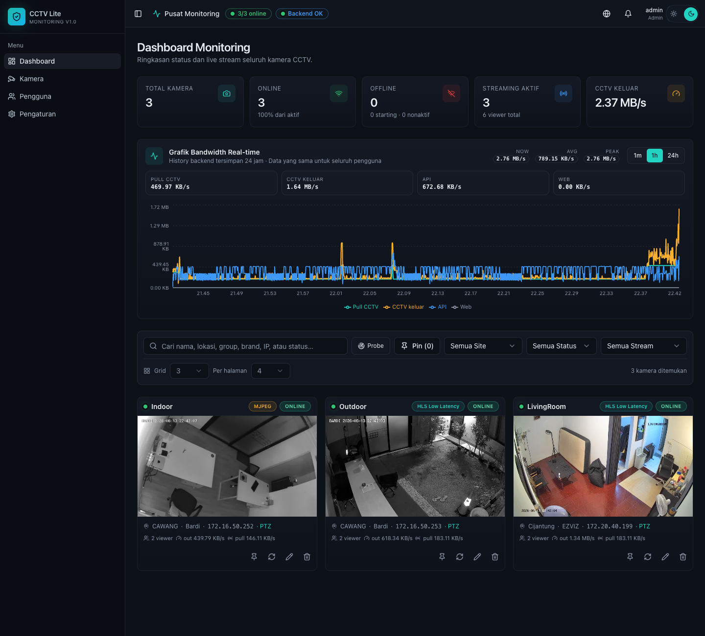
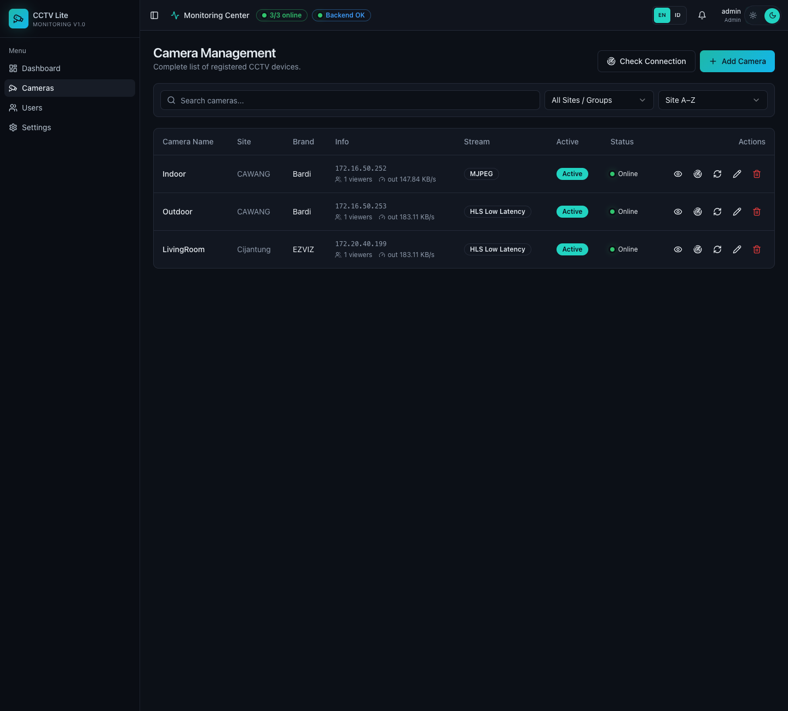
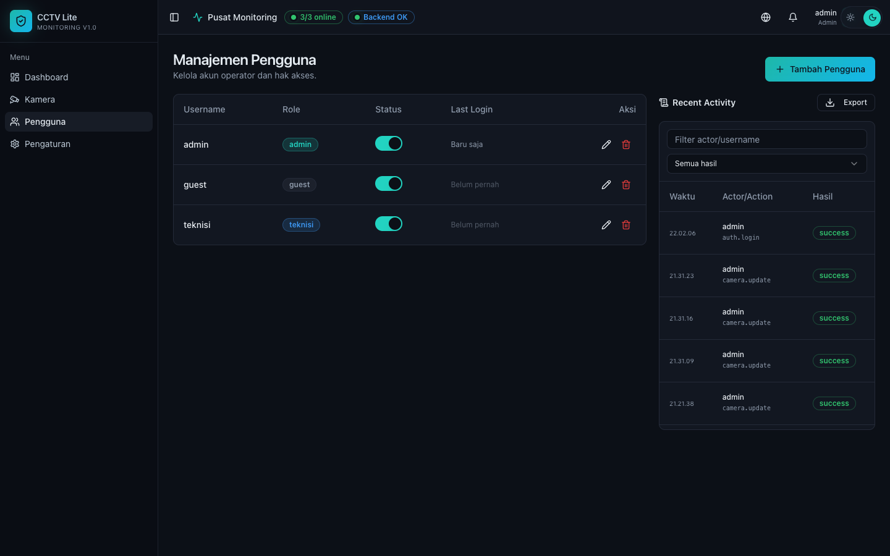

# CCTV Monitoring Lite 🎥

A lightweight, robust, and modern CCTV Dashboard designed for LAN/VPN environments. Built with React, Vite, Express, JSON storage, FFmpeg, and ONVIF PTZ controls.

---

### Language / Bahasa
🌐 **[English](#-english-default)** | 🇮🇩 **[Bahasa Indonesia](#-bahasa-indonesia)**

---

## 🇺🇸 English (Default)

### 🌟 Features
- **First-Run Admin Wizard:** Seamless initial setup with zero default credentials.
- **Role-Based Access Control (RBAC):** Three distinct roles (`admin`, `teknisi`, `guest`) with granular action permissions.
- **RTSP Restreaming & Proxying:** Efficiently transcodes/demuxes RTSP camera feeds into browser-friendly HLS Stable, HLS Low Latency, or MJPEG formats. The system acts as a restreaming proxy—multiple viewers can watch a stream concurrently, but the backend only establishes a single connection process to the camera, protecting network and hardware resources.
- **Dynamic Stream Restarting:** Server automatically restarts the stream process when key parameters (credentials, quality, type) are modified.
- **Audio Fallback Support:** Gracefully retries streaming without audio (`-an`) if FFmpeg crashes while transcoding audio.
- **Interactive Live View:**
  - Control overlays only show on mouse hover.
  - Double-click/button fullscreen toggle (with ESC sync).
  - Custom ONVIF PTZ controls.
- **Smart Notification System:** Bell badge dynamically monitors enabled cameras, displaying active offline statuses and real-world error reasons.
- **User Activity Audit Log:** Detailed auditing of configuration changes, user management actions, and stream requests.
- **User Last Login Tracker:** Real-time relative duration display of user logins ("5 minutes ago", "Yesterday", etc.).

---

### 📸 Previews
#### Dashboard Live View


#### Camera Management


#### User & Access Management


---

### 📋 Prerequisites
Ensure you have the following installed on your host system:
- **Node.js** (v20 or higher)
- **npm** (v10 or higher)
- **FFmpeg & FFprobe** (available in system PATH)

Verify installation using terminal:
```bash
node --version
ffmpeg -version
ffprobe -version
```

---

### ⚙️ Installation & Getting Started

#### 1. Clone the Repository
```bash
git clone https://github.com/aipmy/cctv-stream-control.git
cd cctv-stream-control
```

### 🔄 Updating Existing Installation
To update your dashboard to the latest version, navigate to your root project folder and run:
```bash
git pull
./deploy.sh
```

#### 2. Install Dependencies & Start Backend
Open a terminal directory and navigate to `backend`:
```bash
cd backend
npm install
cp .env.example .env
npm run dev
```

#### 3. Install Dependencies & Start Frontend
Open a separate terminal window at the project root directory:
```bash
npm install
npm run dev:frontend
```

#### 4. Initial Setup
1. Open your browser and navigate to `http://localhost:8080`.
2. As a new installation, you will be automatically redirected to the **Admin Setup Wizard**.
3. Create your first administrative account. No default accounts or passwords exist.

---

### 🚀 Production Deployment
For production, use **PM2** to manage processes and `deploy.sh` for automated deployments.

1. Configure `backend/.env` (set `AUTH_SECRET`, `CORS_ORIGIN`, etc.).
2. Build the application and start PM2:
```bash
npm install
npm --prefix backend install
npm run build
pm2 start ecosystem.config.cjs
pm2 save
```
3. Access the production build at `http://YOUR_SERVER_IP:4200`.

To update in the future, run:
```bash
./deploy.sh
```
*Note: This script automatically backs up `backend/data/` to `backend/backups/` before rebuilding and restarting the PM2 instances.*

---

### 📂 Directory & Data Storage
- **Camera Configurations:** `backend/data/cameras.json`
- **User Database:** `backend/data/users.json`
- **Temporary HLS Cache:** `backend/storage/hls`
- **FFmpeg Logs:** `backend/logs/ffmpeg-stream.log`

---

### 🛡️ Permissions & Access Control
The system supports 5 roles: `admin`, `teknisi`, `guest`, `internal`, and `external`. It features a granular, Popover-based Specific Permissions checklist:
- **Dashboard Permissions:** Allow Statistics (charts & rates).
- **Camera Management Permissions:** View Camera Management, Add Camera, Edit Camera, Delete Camera, Restart Stream, PTZ Control, Play Audio.

Admins have all permissions implicitly allowed. Other users can be granted specific permissions on demand.

---

### 🔌 Brand Compatibility
This dashboard is designed to work with any IP camera supporting standard RTSP and ONVIF profiles, and has been verified with:

- **Bardi CCTV:**
  - Fully supports streaming via local networks (LAN/VPN) without cloud dependencies.
  - Fully supports ONVIF PTZ camera controls (pan, tilt, zoom).
- **EZVIZ CCTV:**
  - Fully supports audio transmission (RTSP audio stream).
  - Fully supports streaming via local networks (LAN/VPN).
  - Fully supports ONVIF PTZ camera controls.

---

---

## 🇮🇩 Bahasa Indonesia

### 🌟 Fitur
- **Wizard Admin Pertama:** Setup awal instalasi yang aman tanpa username/password bawaan.
- **Kontrol Akses Berbasis Role (RBAC):** Tiga peran berbeda (`admin`, `teknisi`, `guest`) dengan hak akses yang terperinci.
- **Restream & Proxy RTSP:** Mengonversi feed RTSP kamera menjadi format HLS Stable, HLS Low Latency, atau MJPEG yang didukung browser. Sistem bertindak sebagai proxy restream—beberapa pengguna dapat menonton satu stream secara bersamaan, tetapi backend hanya membuat satu koneksi ke kamera fisik, menghemat bandwidth jaringan lokal dan beban perangkat kamera.
- **Restart Stream Dinamis:** Server otomatis me-restart proses stream ketika parameter penting kamera (password, kualitas, tipe) diubah.
- **Dukungan Audio Fallback:** Secara otomatis mencoba kembali streaming tanpa audio (`-an`) jika FFmpeg crash saat memproses audio.
- **Live View Interaktif:**
  - Kontrol overlay hanya muncul saat kursor berada di atas kartu kamera.
  - Toggle fullscreen mudah melalui tombol atau klik ganda (sinkron dengan tombol ESC).
  - Kontrol ONVIF PTZ terintegrasi.
- **Notifikasi Offline Cerdas:** Lonceng notifikasi memantau status kamera secara real-time, menampilkan status offline beserta alasan error aslinya.
- **Log Audit Aktivitas:** Pencatatan aktivitas konfigurasi sistem, manajemen pengguna, dan permintaan stream.
- **Pelacak Login Terakhir Pengguna:** Kolom login terakhir di manajemen pengguna dengan format waktu relatif ("5 menit lalu", "Kemarin", dll).

---

### 📸 Tampilan / Preview
#### Live View Dashboard


#### Manajemen Kamera


#### Manajemen Pengguna & Log Aktivitas


---

### 📋 Kebutuhan Sistem
Pastikan perangkat Anda telah terinstall:
- **Node.js** (v20 atau lebih baru)
- **npm** (v10 atau lebih baru)
- **FFmpeg & FFprobe** (terdaftar di system PATH)

Verifikasi instalasi melalui terminal:
```bash
node --version
ffmpeg -version
ffprobe -version
```

---

### ⚙️ Instalasi & Memulai Penggunaan

#### 1. Kloning Repositori
```bash
git clone https://github.com/aipmy/cctv-stream-control.git
cd cctv-stream-control
```

### 🔄 Memperbarui Instalasi yang Ada
Untuk memperbarui dashboard Anda ke versi terbaru, masuk ke direktori utama proyek Anda dan jalankan:
```bash
git pull
./deploy.sh
```

#### 2. Instalasi Dependensi & Jalankan Backend
Buka terminal dan masuk ke direktori `backend`:
```bash
cd backend
npm install
cp .env.example .env
npm run dev
```

#### 3. Instalasi Dependensi & Jalankan Frontend
Buka jendela terminal baru di direktori utama proyek (root):
```bash
npm install
npm run dev:frontend
```

#### 4. Setup Awal
1. Buka browser Anda dan akses `http://localhost:8080`.
2. Pada instalasi kosong, Anda akan diarahkan ke halaman **Setup Admin**.
3. Buat akun admin pertama Anda. Tidak ada akun bawaan demi keamanan.

---

### 🚀 Penyebaran Production
Untuk lingkungan production, disarankan menggunakan **PM2** dan script `deploy.sh`.

1. Konfigurasikan file `backend/.env` (atur `AUTH_SECRET`, `CORS_ORIGIN`, dll.).
2. Build aplikasi dan jalankan PM2:
```bash
npm install
npm --prefix backend install
npm run build
pm2 start ecosystem.config.cjs
pm2 save
```
3. Akses dashboard production di `http://IP_SERVER_ANDA:4200`.

Untuk memperbarui di masa mendatang, jalankan:
```bash
./deploy.sh
```
*Catatan: Script ini mencadangkan database `backend/data/` ke folder `backend/backups/` sebelum melakukan kompilasi ulang dan me-restart instance PM2.*

---

### 📂 Struktur Direktori & Data
- **Konfigurasi Kamera:** `backend/data/cameras.json`
- **Database Pengguna:** `backend/data/users.json`
- **Cache Sementara HLS:** `backend/storage/hls`
- **Log FFmpeg:** `backend/logs/ffmpeg-stream.log`

---

### 🛡️ Hak Akses Peran
Sistem ini mendukung 5 peran: `admin`, `teknisi`, `guest`, `internal`, dan `external`. Sistem ini memiliki daftar Izin Spesifik berbasis Popover checklist yang terperinci:
- **Izin Dashboard:** Izinkan Statistik (grafik & bandwidth).
- **Izin Manajemen Kamera:** Lihat Manajemen Kamera, Tambah Kamera, Edit Kamera, Hapus Kamera, Restart Stream, Izinkan Kontrol PTZ, Izinkan Audio.

Admin memiliki seluruh izin yang diizinkan secara default. Pengguna lain dapat diberikan izin spesifik sesuai kebutuhan.

---

### 🔌 Kompatibilitas Merk CCTV
Dashboard ini dirancang untuk bekerja dengan kamera IP apa pun yang mendukung profil standar RTSP dan ONVIF, dan telah diverifikasi secara luas dengan merk berikut:

- **Bardi CCTV:**
  - Mendukung penuh streaming melalui jaringan lokal (LAN/VPN) tanpa ketergantungan cloud.
  - Mendukung penuh kontrol kamera ONVIF PTZ (pan, tilt, zoom).
- **EZVIZ CCTV:**
  - Mendukung penuh transmisi audio (RTSP audio stream).
  - Mendukung penuh streaming melalui jaringan lokal (LAN/VPN).
  - Mendukung penuh kontrol kamera ONVIF PTZ.
